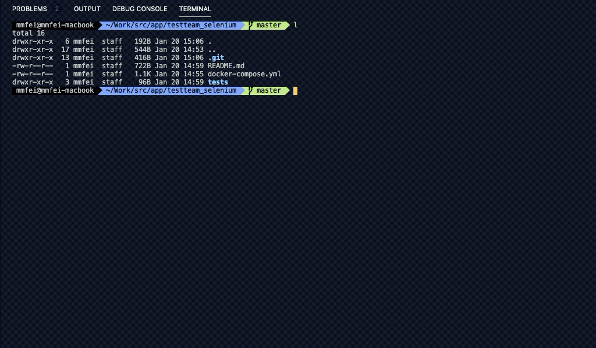

# How to use?
```bash
git clone https://github.com/xgoteam/testteam_selenium;
cd testteam_selenium;
docker-compose up -d;
docker-compose ps;
```

# tests/selenium.test.py
```python
from selenium import webdriver as wd
from selenium.webdriver.common.desired_capabilities import DesiredCapabilities as DC

hub_remote_url = "http://127.0.0.1:4444/wd/hub"
driver = wd.Remote(
	command_executor=hub_remote_url,
  	desired_capabilities=DC.CHROME)

test_url = "http://www.baidu.com"

def test_baidu_screenshot():
	driver.get(test_url)
	driver.save_screenshot("baidu.png")
	print("save baidu screenshot done")

test_baidu_screenshot()
driver.quit()
```

# Run it
```bash
# pip install selenium
python ./test/selenium.test.py;
```


